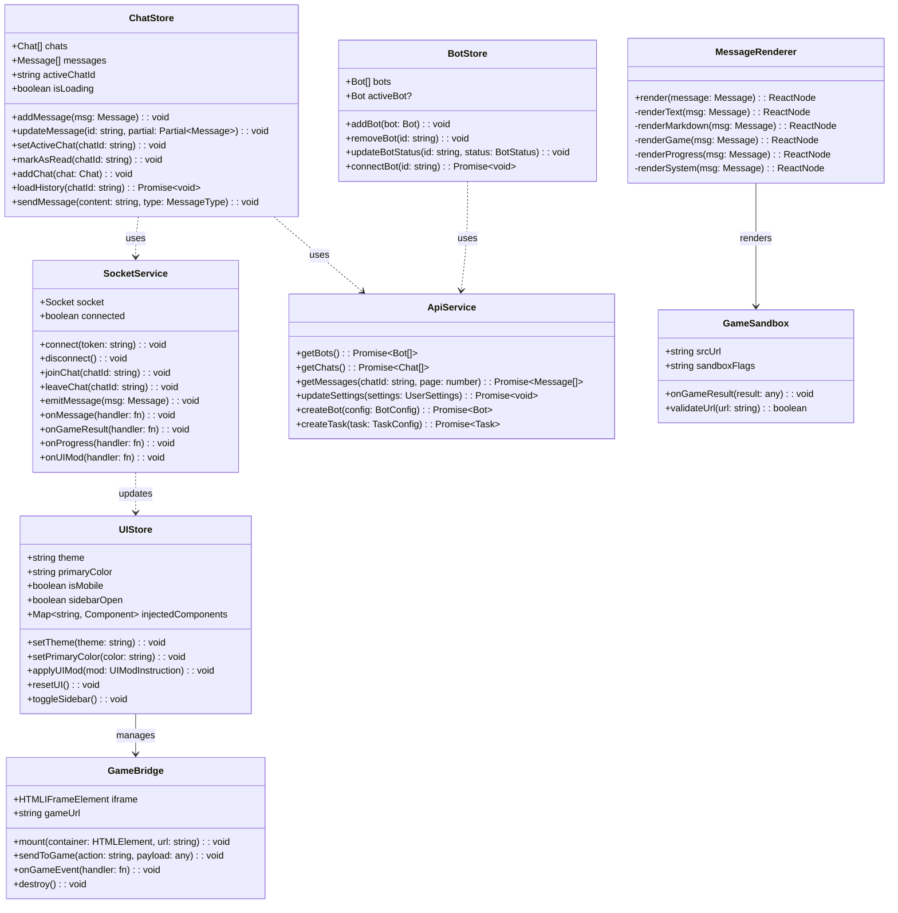
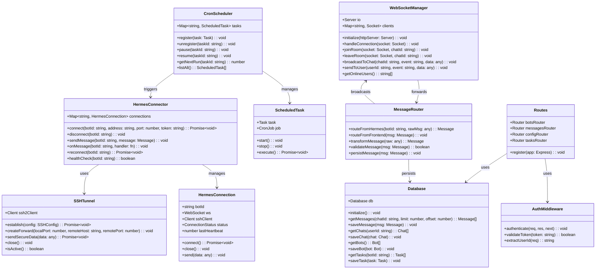
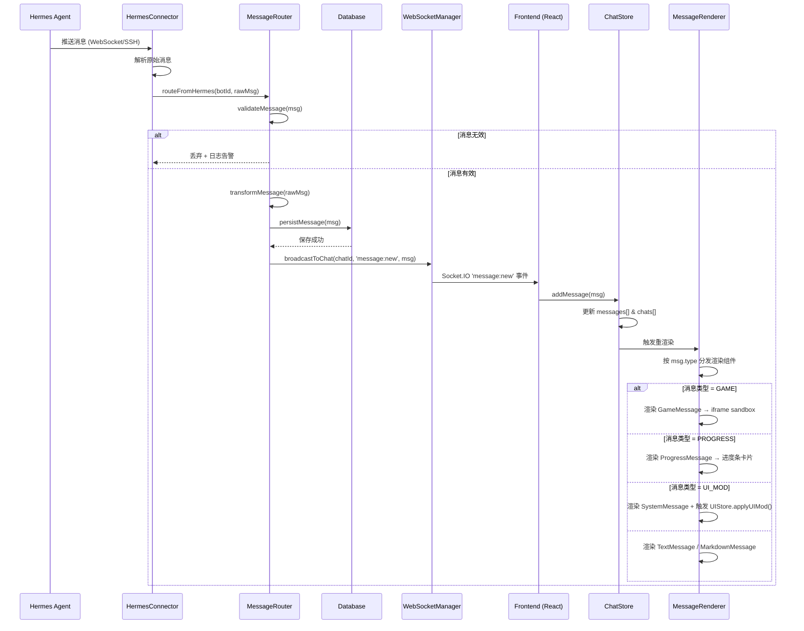
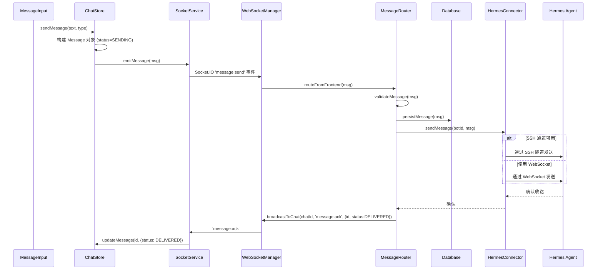
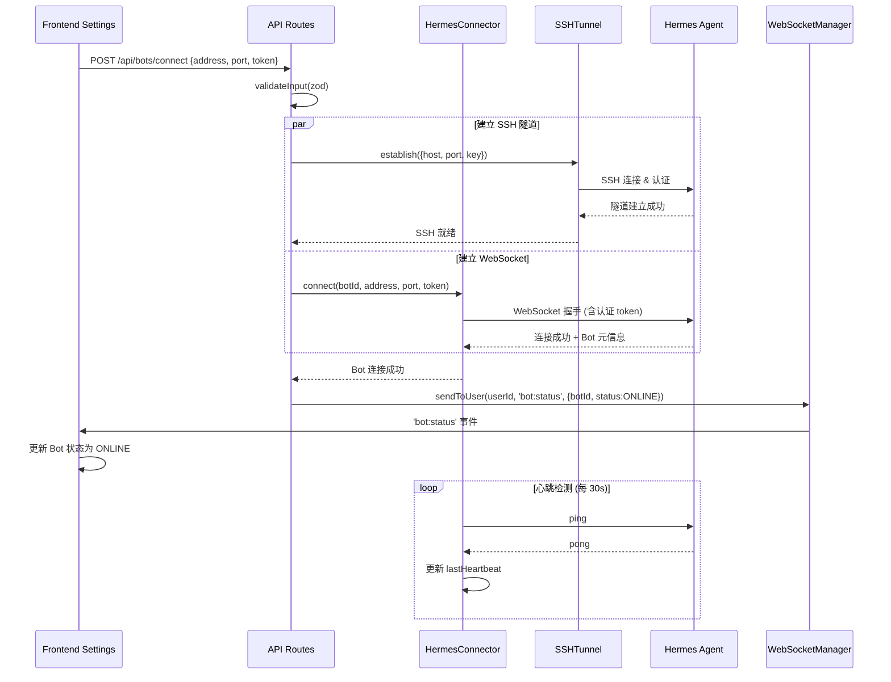
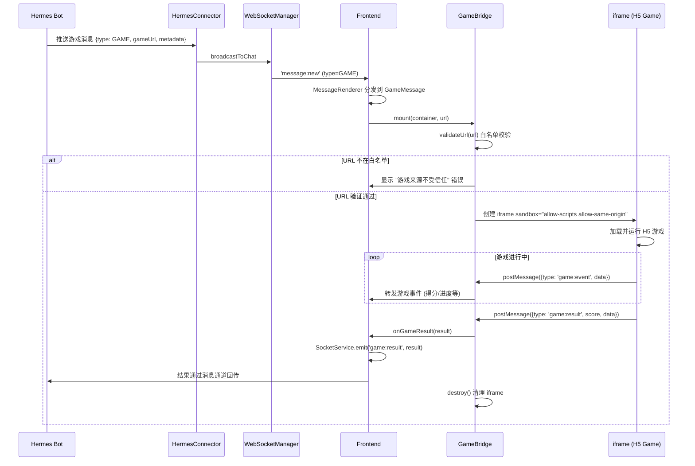
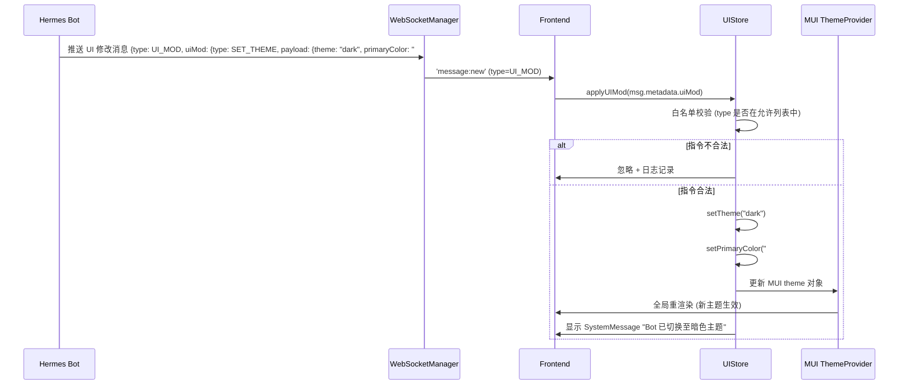
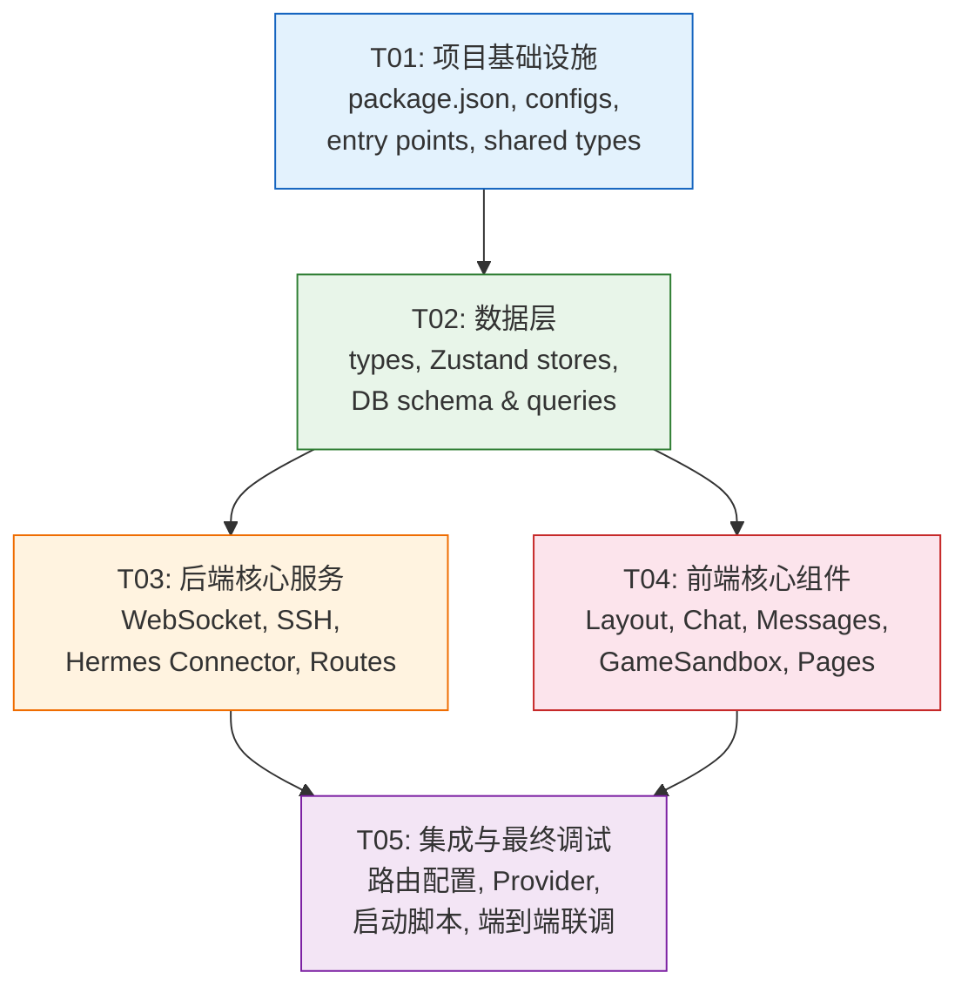

# Hermes Chat — 系统架构设计

> **文档版本**: v1.0  
> **作者**: Bob (Architect)  
> **日期**: 2025-07-15  
> **项目代号**: `hermes-chat`

---

## Part A: 系统设计

---

### 1. 实现方案

#### 1.1 核心技术挑战

| 挑战 | 描述 | 应对策略 |
|------|------|---------|
| **三段式实时通信** | 前端 ↔ 后端 ↔ Hermes 三段 WebSocket 链路需保持低延迟、高可靠 | 后端采用双向 WS 代理模式：前端用 Socket.IO（自动重连/心跳），后端↔Hermes 用原生 ws |
| **HTML5 游戏安全沙箱** | iframe 内运行第三方 HTML5 游戏有 XSS/数据泄露风险 | `sandbox="allow-scripts allow-same-origin"` + `postMessage` 受限通信 + CSP 头 + 白名单校验 |
| **SSH 隧道传输** | 关键数据需走 SSH 加密，但不能影响消息实时性 | 双通道设计：SSH 用于凭据/配置/游戏结果（安全优先），WebSocket 用于普通消息流（实时优先） |
| **Bot 动态 UI 注入** | Bot 修改 UI 的安全边界控制 | 采用「声明式指令」而非「代码注入」：Bot 发送 JSON 指令（换肤/添加组件属性），前端以白名单机制解释执行——拒绝任意脚本注入 |
| **多端响应式** | 桌面双栏 + 移动单栏的两套交互模式 | MUI `useMediaQuery` + Tailwind `lg:` 断点 + React Router 嵌套路由，移动端用 `react-router` 的 `Outlet` 实现页面切换 |

#### 1.2 框架与库选型

**前端（Frontend）**

| 职责 | 选型 | 版本 | 理由 |
|------|------|------|------|
| 构建工具 | Vite | ^5.4 | 快速 HMR，原生 ESM，React 插件成熟 |
| UI 框架 | React | ^18.3 | 生态丰富，MUI 深度集成 |
| 组件库 | MUI (Material UI) | ^5.16 | 成熟的设计系统，响应式开箱即用 |
| CSS 工具 | Tailwind CSS | ^3.4 | 原子化 CSS，与 MUI 互补使用 |
| 状态管理 | Zustand | ^4.5 | 轻量、无 boilerplate、支持订阅切片 |
| 路由 | React Router | ^6.25 | 嵌套路由支持桌面/移动布局切换 |
| WebSocket 客户端 | Socket.IO Client | ^4.7 | 自动重连、心跳、房间管理 |
| Markdown 渲染 | react-markdown | ^9.0 | 安全 Markdown 渲染，可禁用 HTML |
| 语法高亮 | rehype-highlight | ^7.0 | 代码块高亮 |
| 图表/进度 | MUI 内置组件 | — | LinearProgress、CircularProgress |

**后端（Backend）**

| 职责 | 选型 | 版本 | 理由 |
|------|------|------|------|
| 运行时 | Node.js | >=20 LTS | 前后端统一语言，事件驱动适合 WebSocket |
| Web 框架 | Express.js | ^4.19 | 成熟稳定，生态丰富 |
| WebSocket 服务端 | Socket.IO | ^4.7 | 房间/命名空间管理，自动重连 |
| WebSocket 客户端(连 Hermes) | ws | ^8.17 | 轻量原生 WebSocket，适合服务端到服务端 |
| SSH 客户端 | ssh2 | ^1.16 | 纯 JS 实现，支持端口转发/隧道 |
| 定时任务 | node-cron | ^3.0 | Cron 表达式解析与调度 |
| 数据库 | better-sqlite3 | ^11.1 | 零配置、高性能、单文件部署 |
| 数据验证 | zod | ^3.23 | 类型安全验证，前后端共享 schema |
| 日志 | pino | ^9.3 | 高性能结构化日志 |

#### 1.3 架构模式

```
┌──────────────┐     Socket.IO      ┌──────────────┐     ws / SSH2      ┌──────────────┐
│   Frontend   │ ◄────────────────► │   Backend    │ ◄────────────────► │   Hermes     │
│  (Vite+React)│    (实时消息+事件)   │ (Node/Express)│   (ws 消息通道)    │  (云端智能体) │
│              │                    │              │   (SSH 安全通道)   │              │
└──────────────┘                    └──────────────┘                    └──────────────┘
                                           │
                                           ▼
                                    ┌──────────────┐
                                    │   SQLite DB  │
                                    │  (消息/配置)  │
                                    └──────────────┘
```

**核心模式**:
- **前端**: MVVM 风格 — Zustand Store (Model) → React Components (View) → Hooks (ViewModel)
- **后端**: 分层架构 — Routes → Services → DB
- **通信**: 发布/订阅 — 后端作为消息代理，前端订阅 Bot 频道，Hermes 通过后端广播

---

### 2. 文件列表

```
hermes-chat/
│
├── package.json                          # 前端项目配置 & 脚本
├── index.html                            # Vite 入口 HTML
├── vite.config.ts                        # Vite 构建配置
├── tsconfig.json                         # TypeScript 配置
├── tsconfig.node.json                    # Node 端 TS 配置
├── tailwind.config.ts                    # Tailwind CSS 配置
├── postcss.config.js                     # PostCSS 配置
├── .env.example                          # 环境变量模板
│
├── shared/                               # 前后端共享类型与常量
│   ├── types.ts                          # 共享类型定义 (Message, Bot, User, UIMod)
│   └── constants.ts                      # 共享常量 (事件名, 消息类型枚举)
│
├── src/                                  # 前端源码
│   ├── main.tsx                          # React 入口，挂载根组件
│   ├── App.tsx                           # 根组件，路由配置 + Provider 包裹
│   ├── index.css                         # 全局样式 & Tailwind 指令
│   ├── vite-env.d.ts                     # Vite 类型声明
│   │
│   ├── types/                            # 前端类型（扩展共享类型）
│   │   └── index.ts                      # UI 专用类型 + 共享类型 re-export
│   │
│   ├── config/                           # 前端配置
│   │   ├── index.ts                      # 配置聚合
│   │   └── constants.ts                  # 前端常量 (断点, 主题色, 默认值)
│   │
│   ├── store/                            # Zustand 状态管理
│   │   ├── chatStore.ts                  # 聊天状态 (会话列表, 当前会话, 消息)
│   │   ├── botStore.ts                   # Bot 管理状态
│   │   └── uiStore.ts                    # UI 状态 (主题, 布局, Bot 注入组件)
│   │
│   ├── services/                         # 外部服务封装
│   │   ├── socket.ts                     # Socket.IO 客户端封装 (连接/重连/事件)
│   │   ├── api.ts                        # REST API 调用 (配置/历史消息)
│   │   └── gameBridge.ts                 # iframe ↔ 主页面 postMessage 通信桥
│   │
│   ├── hooks/                            # 自定义 Hooks
│   │   ├── useChat.ts                    # 聊天逻辑 (发消息, 拉历史, 已读)
│   │   ├── useSocket.ts                  # WebSocket 连接状态 & 事件订阅
│   │   ├── useTheme.ts                   # 主题切换 (含 Bot 动态换肤)
│   │   └── useResponsive.ts              # 响应式断点检测
│   │
│   ├── components/                       # UI 组件
│   │   ├── layout/
│   │   │   ├── AppLayout.tsx             # 顶层布局容器 (桌面/移动自适应)
│   │   │   ├── TopNavbar.tsx             # 顶部导航栏
│   │   │   ├── Sidebar.tsx               # 桌面端左栏会话列表容器
│   │   │   └── BottomNav.tsx             # 移动端底部 Tab 导航
│   │   │
│   │   ├── chat/
│   │   │   ├── ChatList.tsx              # 会话列表组件
│   │   │   ├── ChatListItem.tsx          # 单个会话条目 (头像/名称/预览/徽章)
│   │   │   ├── ChatArea.tsx              # 对话区容器
│   │   │   ├── MessageList.tsx           # 消息列表 (虚拟滚动容器)
│   │   │   ├── MessageBubble.tsx         # 消息气泡外壳 (发送/接收样式)
│   │   │   ├── MessageRenderer.tsx       # 消息类型分发器 (按 type 渲染不同组件)
│   │   │   └── MessageInput.tsx          # 消息输入区 (文本+发送按钮)
│   │   │
│   │   ├── messages/                     # 各类型消息渲染组件
│   │   │   ├── TextMessage.tsx           # 纯文本消息
│   │   │   ├── MarkdownMessage.tsx       # Markdown 渲染消息
│   │   │   ├── GameMessage.tsx           # HTML5 游戏内嵌消息
│   │   │   ├── ProgressMessage.tsx       # 任务进度通知卡片
│   │   │   └── SystemMessage.tsx         # 系统通知消息
│   │   │
│   │   └── common/                       # 通用组件
│   │       ├── Avatar.tsx                # 头像组件
│   │       ├── Badge.tsx                 # 未读/状态徽章
│   │       ├── Spinner.tsx               # 加载指示器
│   │       └── GameSandbox.tsx           # iframe 沙箱容器 (安全渲染 H5)
│   │
│   ├── pages/                            # 页面组件
│   │   ├── ChatPage.tsx                  # 聊天主页 (桌面: 双栏 / 移动: 列表或详情)
│   │   ├── BotsPage.tsx                  # Bot 管理页
│   │   ├── TasksPage.tsx                 # 定时任务列表页
│   │   └── SettingsPage.tsx              # 设置页 (Hermes 连接配置, 主题)
│   │
│   └── utils/                            # 工具函数
│       ├── format.ts                     # 时间/文本格式化
│       ├── markdown.ts                   # Markdown 渲染配置 & 安全过滤
│       └── sanitize.ts                   # HTML/URL 安全清洗 (DOMPurify)
│
├── server/                               # 后端源码
│   ├── package.json                      # 后端项目配置
│   ├── tsconfig.json                     # 后端 TS 配置
│   ├── .env.example                      # 后端环境变量模板
│   │
│   └── src/
│       ├── index.ts                      # 服务入口 (Express + Socket.IO 启动)
│       ├── config.ts                     # 后端配置 (从环境变量加载, zod 校验)
│       │
│       ├── types/
│       │   └── index.ts                  # 后端类型 (扩展共享类型, DB 模型)
│       │
│       ├── db/
│       │   ├── connection.ts             # SQLite 连接管理
│       │   ├── schema.ts                 # 表结构定义 & 初始化
│       │   └── queries.ts                # 数据访问层 (消息/会话/Bot CRUD)
│       │
│       ├── services/
│       │   ├── websocketManager.ts       # Socket.IO 服务端逻辑 (房间/事件/心跳)
│       │   ├── hermesConnector.ts        # Hermes WebSocket 连接管理 (连接池/重连)
│       │   ├── messageRouter.ts          # 消息路由: Hermes ↔ Frontend 双向转发
│       │   ├── sshTunnel.ts              # SSH 隧道管理 (建立/维护/认证)
│       │   └── cronScheduler.ts          # Cron 定时任务调度器
│       │
│       ├── routes/
│       │   ├── index.ts                  # 路由聚合
│       │   ├── bots.ts                   # Bot CRUD API
│       │   ├── messages.ts               # 消息历史 API
│       │   ├── config.ts                 # 用户配置 API (Hermes 连接设置)
│       │   └── tasks.ts                  # 定时任务 CRUD API
│       │
│       └── middleware/
│           ├── auth.ts                   # 认证中间件 (API Key / Token 校验)
│           ├── rateLimit.ts              # 速率限制
│           └── errorHandler.ts           # 全局错误处理
```

---

### 3. 数据结构与接口

#### 3.1 共享类型层 (`shared/types.ts`)

```mermaid
classDiagram
    direction TB

    class MessageType {
        <<enumeration>>
        TEXT
        MARKDOWN
        GAME
        PROGRESS
        SYSTEM
        UI_MOD
    }

    class MessageStatus {
        <<enumeration>>
        SENDING
        SENT
        DELIVERED
        READ
        FAILED
    }

    class Message {
        +string id
        +MessageType type
        +string chatId
        +string senderId
        +string content
        +MessageMetadata metadata
        +MessageStatus status
        +number timestamp
        +number editedAt?
    }

    class MessageMetadata {
        +string gameUrl?
        +number progressValue?
        +number progressMax?
        +string progressLabel?
        +UIModInstruction uiMod?
        +string replyTo?
    }

    class UIModInstruction {
        +UIModType type
        +string payload
    }

    class UIModType {
        <<enumeration>>
        SET_THEME
        SET_PRIMARY_COLOR
        ADD_BUTTON
        SHOW_MODAL
        SET_BACKGROUND
    }

    class Chat {
        +string id
        +string title
        +string botId
        +string lastMessage?
        +number unreadCount
        +number updatedAt
        +number createdAt
    }

    class Bot {
        +string id
        +string name
        +string avatarUrl?
        +string hermesAddress
        +number hermesPort
        +string authToken?
        +BotStatus status
        +number lastSeen
    }

    class BotStatus {
        <<enumeration>>
        ONLINE
        OFFLINE
        CONNECTING
        ERROR
    }

    class Task {
        +string id
        +string botId
        +string name
        +string cronExpression
        +string action
        +TaskStatus status
        +number lastRun?
        +number nextRun?
    }

    class TaskStatus {
        <<enumeration>>
        ACTIVE
        PAUSED
        COMPLETED
        ERROR
    }

    class User {
        +string id
        +string name
        +string avatarUrl?
        +UserSettings settings
    }

    class UserSettings {
        +string theme
        +string primaryColor
        +boolean notifications
        +string language
    }

    Message --> MessageType
    Message --> MessageStatus
    Message --> MessageMetadata
    MessageMetadata --> UIModInstruction
    UIModInstruction --> UIModType
    Chat --> Bot
    Bot --> BotStatus
    Task --> TaskStatus
    Task --> Bot
    User --> UserSettings
```



#### 3.2 前端核心接口 (`src/`)



#### 3.3 后端核心接口 (`server/src/`)



---

### 4. 程序调用流程

#### 4.1 消息发送完整链路 (Hermes → 后端 → 前端)



#### 4.2 用户发送消息链路 (前端 → 后端 → Hermes)



#### 4.3 Bot 连接建立流程



#### 4.4 HTML5 游戏生命周期



#### 4.5 Bot 动态换肤流程



---

### 5. 待明确事项 (Anything UNCLEAR)

| # | 问题 | 当前假设 | 风险 |
|---|------|---------|------|
| Q1 | HTML5 游戏来源白名单策略 | **假设**: 仅允许配置中预定义的域名列表（默认仅 `hermes-games.local`），用户可在设置中手动添加可信域名 | 若需支持任意 URL，需调整 CSP 策略和 sandbox 属性 |
| Q2 | SSH 实现方式 | **假设**: 使用 `ssh2` 库在后端自建 SSH 客户端，连接用户指定的 Hermes 主机 | 若需复用系统 SSH 隧道，架构及部署方式不同 |
| Q3 | 手机端作为 Hermes 节点 | **假设**: 列为 P2，当前架构暂不实现。若提升为 P1，需引入 NAT 穿透方案（如 STUN/TURN） | 架构复杂度显著增加 |
| Q4 | Bot UI 修改权限边界 | **假设**: 仅允许预设的白名单操作（`SET_THEME`, `SET_PRIMARY_COLOR`, `SET_BACKGROUND`），**禁止**任意代码注入。`ADD_BUTTON` 和 `SHOW_MODAL` 列为后期扩展 | 若需任意组件注入，需设计完整的沙箱组件系统 |
| Q5 | 用户认证方案 | **假设**: MVP 采用简单的 API Key / 设备绑定方案（存储在本地 localStorage + 后端验证） | 若需多设备同步/OAuth，认证架构需调整 |
| Q6 | 多 Bot 会话独立性 | **假设**: 每个 Bot 会话完全独立，不共享上下文。Bot 之间不互通消息 | 若需跨 Bot 上下文共享，消息路由逻辑需修改 |

---

## Part B: 任务分解

---

### 6. 依赖包列表

#### 前端 (`package.json`)

```
- react@^18.3.0: UI 框架
- react-dom@^18.3.0: React DOM 渲染
- @mui/material@^5.16.0: Material UI 组件库
- @mui/icons-material@^5.16.0: Material Icons
- @emotion/react@^11.12.0: MUI 样式引擎
- @emotion/styled@^11.12.0: MUI 样式组件
- tailwindcss@^3.4.0: 原子化 CSS 框架
- autoprefixer@^10.4.0: CSS 前缀自动补全
- postcss@^8.4.0: CSS 后处理
- react-router-dom@^6.25.0: 前端路由
- socket.io-client@^4.7.0: WebSocket 客户端
- zustand@^4.5.0: 状态管理
- react-markdown@^9.0.0: Markdown 渲染
- rehype-highlight@^7.0.0: 代码块语法高亮
- dompurify@^3.1.0: HTML 清洗
- zod@^3.23.0: 运行时类型验证
```

#### 前端开发依赖

```
- vite@^5.4.0: 构建工具
- @vitejs/plugin-react@^4.3.0: Vite React 插件
- typescript@^5.5.0: 类型检查
- @types/react@^18.3.0: React 类型定义
- @types/react-dom@^18.3.0: ReactDOM 类型定义
- @types/dompurify@^3.0.0: DOMPurify 类型定义
```

#### 后端 (`server/package.json`)

```
- express@^4.19.0: Web 框架
- socket.io@^4.7.0: WebSocket 服务端
- ws@^8.17.0: 原生 WebSocket 客户端 (连接 Hermes)
- ssh2@^1.16.0: SSH 客户端/隧道
- better-sqlite3@^11.1.0: SQLite 数据库
- node-cron@^3.0.0: Cron 定时任务
- zod@^3.23.0: 数据验证
- pino@^9.3.0: 日志
- pino-pretty@^11.2.0: 开发环境美化日志
- dotenv@^16.4.0: 环境变量加载
- cors@^2.8.0: 跨域处理
- uuid@^10.0.0: UUID 生成
```

#### 后端开发依赖

```
- typescript@^5.5.0: 类型检查
- tsx@^4.16.0: TypeScript 执行 (开发)
- @types/express@^4.17.0: Express 类型定义
- @types/better-sqlite3@^7.6.0: SQLite 类型定义
- @types/ssh2@^1.15.0: ssh2 类型定义
- @types/ws@^8.5.0: ws 类型定义
- @types/cors@^2.8.0: cors 类型定义
- @types/uuid@^10.0.0: uuid 类型定义
- @types/node-cron@^3.0.0: node-cron 类型定义
- nodemon@^3.1.0: 热重载
```

---

### 7. 任务列表 (有序，含依赖)

| Task ID | 任务名称 | 源文件 | 依赖 | 优先级 |
|---------|---------|--------|------|--------|
| **T01** | **项目基础设施** | `package.json`, `index.html`, `vite.config.ts`, `tsconfig.json`, `tsconfig.node.json`, `tailwind.config.ts`, `postcss.config.js`, `.env.example`, `src/index.css`, `src/vite-env.d.ts`, `src/main.tsx`, `src/App.tsx`, `server/package.json`, `server/tsconfig.json`, `server/.env.example`, `shared/types.ts`, `shared/constants.ts` | 无 | P0 |
| **T02** | **数据层：类型、状态管理、数据库** | `src/types/index.ts`, `src/store/chatStore.ts`, `src/store/botStore.ts`, `src/store/uiStore.ts`, `server/src/types/index.ts`, `server/src/db/connection.ts`, `server/src/db/schema.ts`, `server/src/db/queries.ts`, `server/src/config.ts` | T01 | P0 |
| **T03** | **后端核心服务** | `server/src/index.ts`, `server/src/services/websocketManager.ts`, `server/src/services/hermesConnector.ts`, `server/src/services/messageRouter.ts`, `server/src/services/sshTunnel.ts`, `server/src/services/cronScheduler.ts`, `server/src/routes/index.ts`, `server/src/routes/bots.ts`, `server/src/routes/messages.ts`, `server/src/routes/config.ts`, `server/src/routes/tasks.ts`, `server/src/middleware/auth.ts`, `server/src/middleware/rateLimit.ts`, `server/src/middleware/errorHandler.ts` | T02 | P0 |
| **T04** | **前端核心组件与页面** | `src/config/index.ts`, `src/config/constants.ts`, `src/services/socket.ts`, `src/services/api.ts`, `src/services/gameBridge.ts`, `src/hooks/useChat.ts`, `src/hooks/useSocket.ts`, `src/hooks/useTheme.ts`, `src/hooks/useResponsive.ts`, `src/components/layout/AppLayout.tsx`, `src/components/layout/TopNavbar.tsx`, `src/components/layout/Sidebar.tsx`, `src/components/layout/BottomNav.tsx`, `src/components/chat/ChatList.tsx`, `src/components/chat/ChatListItem.tsx`, `src/components/chat/ChatArea.tsx`, `src/components/chat/MessageList.tsx`, `src/components/chat/MessageBubble.tsx`, `src/components/chat/MessageRenderer.tsx`, `src/components/chat/MessageInput.tsx`, `src/components/messages/TextMessage.tsx`, `src/components/messages/MarkdownMessage.tsx`, `src/components/messages/GameMessage.tsx`, `src/components/messages/ProgressMessage.tsx`, `src/components/messages/SystemMessage.tsx`, `src/components/common/Avatar.tsx`, `src/components/common/Badge.tsx`, `src/components/common/Spinner.tsx`, `src/components/common/GameSandbox.tsx`, `src/pages/ChatPage.tsx`, `src/pages/BotsPage.tsx`, `src/pages/TasksPage.tsx`, `src/pages/SettingsPage.tsx`, `src/utils/format.ts`, `src/utils/markdown.ts`, `src/utils/sanitize.ts` | T02 | P0 |
| **T05** | **集成、路由与最终调试** | `src/App.tsx` (更新路由配置), `src/main.tsx` (更新 Provider), `server/src/index.ts` (最终集成), `server/src/routes/index.ts` (路由注册), `package.json` (更新启动脚本) | T03, T04 | P0 |

---

### 8. 共享知识 (Shared Knowledge)

```
=== 通信协议 ===
- 前端 ↔ 后端: Socket.IO, 事件命名采用 'namespace:action' 格式 (如 'message:send', 'bot:connect')
- 后端 ↔ Hermes: 原生 WebSocket (ws), 消息格式为 JSON {type, payload, timestamp, traceId}
- SSH 通道: 仅用于关键数据 (认证凭据、游戏结果), 运行时为每个 Hermes 连接建立独立 SSH 隧道

=== 消息格式 ===
- 所有消息都包含 traceId (UUID v4), 用于全链路追踪
- 时间戳统一使用 Unix 毫秒时间戳 (number)
- 消息体 content 字段为 string (文本/Markdown) 或 stringified JSON (游戏/进度/UI指令)

=== 安全规范 ===
- iframe 游戏沙箱: sandbox="allow-scripts allow-same-origin", 禁止 allow-top-navigation / allow-popups
- Bot UI 指令白名单: SET_THEME, SET_PRIMARY_COLOR, SET_BACKGROUND 三类, 拒绝其他指令
- URL 白名单: 游戏 URL 必须在服务端配置的白名单域名内, 前端做二次校验
- 所有用户输入经 DOMPurify 清洗后渲染

=== 响应式断点 ===
- 移动端: < 768px (单栏, 底部 Tab 导航)
- 平板: 768px - 1024px (单栏, 可选侧边栏抽屉)
- 桌面端: >= 1024px (双栏, 侧边栏 320px 固定 + 对话区自适应)

=== 状态管理 ===
- Zustand stores 单一数据源
- 消息通过 Socket.IO 事件更新到 store, 不通过组件本地 state
- UIStore 的 injectedComponents 仅存储组件配置元数据, 不存储组件代码

=== 数据持久化 ===
- SQLite 仅在后端使用, 前端不直接访问
- 消息历史按需分页加载 (每次 50 条)
- 会话列表按 updatedAt 降序排列

=== 错误处理 ===
- 后端统一错误格式: { success: false, error: { code: string, message: string } }
- 前端统一在 SocketService 和 ApiService 层处理错误
- 连接断开时前端显示重连提示 (Snackbar), 自动重连最多 10 次
```

---

### 9. 任务依赖图


